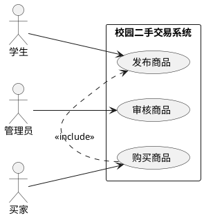

# UML 建模 Agent 详细技术方案（v13 · 核心）

> 本方案把 UML Agent 从 PRD 落到可实现的技术细节：数据结构、链路、Prompt、分图校验规则库、双重验证。
> 更新：2026-09-21，从"用例图单图"扩展为"用例图 / 活动图 / 状态机图"多图类型。

---

## 1. Agent 结构

```
UML Agent
  ├─ 图类型路由      （用户指定 or LLM 意图识别）
  ├─ 需求理解 Chain   （LLM：按图类型抽取模型元素）
  ├─ 领域模型抽取     （结构化中间 JSON，pydantic 校验）
  ├─ UML 生成 Chain   （JSON → PlantUML 源码，模板渲染）
  ├─ PlantUML Tool    （源码 → PNG）
  ├─ 质量检查         （分图规则引擎 + LLM 复核）
  ├─ 定向迭代         （分条修改指令 → 重生成 → 再审查）
  └─ 输出组装         （图 + 审查报告 + 迭代记录）
```

## 2. 数据结构

### 2.1 图类型枚举

```python
class DiagramType(str, Enum):
    USECASE = "usecase"      # 用例图
    ACTIVITY = "activity"    # 活动图
    STATEMACHINE = "statemachine"  # 状态机图
```

### 2.2 中间 JSON（按图类型）

**用例图模型（v0.1 保留）**

```json
{
  "type": "usecase",
  "system": "校园二手交易系统",
  "actors": [
    {"name": "学生", "role": "primary"},
    {"name": "管理员", "role": "supporting"},
    {"name": "买家", "role": "primary"}
  ],
  "usecases": [
    {"id": "UC-01", "name": "发布商品", "actors": ["学生"], "goal": "发布二手商品"},
    {"id": "UC-02", "name": "审核商品", "actors": ["管理员"], "goal": "审核上架"},
    {"id": "UC-03", "name": "购买商品", "actors": ["买家"], "goal": "完成购买"}
  ],
  "relations": [
    {"type": "include", "from": "UC-03", "to": "UC-01", "note": ""},
    {"type": "extend", "from": "UC-03", "to": "UC-04", "note": "使用优惠券"}
  ]
}
```

**活动图模型**

```json
{
  "type": "activity",
  "module": "AI学业预警平台——智能预警与成长干预模块",
  "swimlanes": [
    {"name": "定时任务调度器"}, {"name": "AI推演与决策引擎"},
    {"name": "授课教师/辅导员"}, {"name": "学生"}
  ],
  "nodes": [
    {"id": "A-01", "name": "触发多源数据采集任务", "lane": "定时任务调度器", "kind": "action"},
    {"id": "A-02", "name": "采集教务系统学业成绩", "lane": "AI推演与决策引擎", "kind": "action"},
    {"id": "D-01", "name": "是否需要修改干预方案", "lane": "授课教师/辅导员", "kind": "decision",
     "branches": [{"cond": "[需要修改干预方案]", "to": "修改干预方案"}, {"cond": "[无需修改干预方案]", "to": "确认干预方案"}]},
    {"id": "F-01", "kind": "fork"}, {"id": "J-01", "kind": "join"}
  ],
  "flows": [
    {"from": "A-01", "to": "F-01"},
    {"from": "F-01", "to": "A-02"},
    {"from": "D-01", "to": "修改干预方案", "cond": "[需要修改干预方案]"},
    {"from": "D-01", "to": "确认干预方案", "cond": "[无需修改干预方案]"}
  ]
}
```

**状态机图模型**

```json
{
  "type": "statemachine",
  "object": "AI学业预警平台——预警信息",
  "states": [
    {"id": "S-01", "name": "预警草稿待生成", "kind": "initial"},
    {"id": "S-02", "name": "已生成待审核"},
    {"id": "S-10", "name": "预警已暂停挂起", "kind": "paused", "history": "shallow"},
    {"id": "S-09", "name": "预警闭环已归档", "kind": "final"}
  ],
  "transitions": [
    {"from": "S-01", "to": "S-02", "event": "规则匹配命中"},
    {"from": "S-02", "to": "S-03", "event": "审核通过", "guard": "审核等级≥3级"},
    {"from": "S-02", "to": "S-04", "event": "审核驳回", "guard": "审核等级<3级"},
    {"from": "S-09", "event": "中断挂起", "to": "S-10", "any_state": true},
    {"from": "S-10", "to": "history", "event": "恢复预警"}
  ]
}
```

### 2.3 审查报告

```json
{
  "diagram_type": "statemachine",
  "passed": false,
  "checks": [
    {"rule_group": "转换逻辑", "type": "event_completeness", "level": "error",
     "target": "S-02→S-05", "table_ref": "表7-6",
     "message": "转换未标注触发事件",
     "suggestion": "标注触发事件（调用/变化/时间/信号事件之一）"},
    {"rule_group": "状态与生命周期", "type": "state_granularity", "level": "warning",
     "target": "正在执行XXX", "table_ref": "表7-4",
     "message": "这是动作节点，不是稳定状态",
     "suggestion": "调整为动作，或合并为复合状态内部子状态"}
  ],
  "llm_review": {"passed": true, "comment": "整体结构合理"}
}
```

## 3. 链路详细设计

### Step0 图类型路由

- 用户显式指定（"画活动图/状态机图"）→ 直接路由；
- 未指定 → LLM 意图识别（候选：usecase / activity / statemachine / other）；
- 识别为 other（类图/时序图等）→ 提示"该图类型列入后续版本"，给出任务章节与互动点（对齐辅助实践 PRD 全景表）。

### Step1 需求理解（LLM，按图类型）

**用例图 Prompt（v0.1 保留）**
```
你是一名资深软件需求分析师。
请根据用户需求：
1. 识别系统边界；2. 识别参与者（Actor）；3. 识别核心业务功能（Use Case）；4. 生成用例列表。
约束：不要把系统内部模块作为参与者（如数据库）；不要把操作步骤作为用例（如"点击按钮"）。
输出为 JSON：{"system","actors","usecases","relations"}
```

**活动图 Prompt（对齐教材表 6-1 初始提示词结构）**
```
请为[模块名称]生成 PlantUML 活动图。
参与者（泳道）包括：[角色清单]。
动作节点按执行顺序包括：[动作列表]。
控制逻辑说明：[顺序/分支/并行/跨分区关系]。
要求：使用泳道清晰划分责任分区；分叉节点与汇合节点成对出现；
决策节点须标注监护条件（如"[需要修改干预方案]"和"[无需修改干预方案]"）。
```

**状态机图 Prompt（对齐教材表 7-3 初始提示词结构）**
```
请为[对象名称]生成 PlantUML 状态机图。
状态包括：[按生命周期顺序的状态列表]。
转换关系如下：[源状态→目标状态（触发事件：XXX）]。
要求：使用初始伪状态（●）标识起点；使用最终状态（◉）标识终点；
状态转换箭头上标注触发事件名称；暂停挂起场景使用浅历史状态（H）实现断点恢复。
```

- 需求不完整 → 返回"需要澄清的问题清单"（对应辅助实践·启发思考），不强行出模型。

### Step2 领域模型抽取

- 按图类型使用对应 pydantic 模型（`UMLModel` / `ActivityModel` / `StateMachineModel`）校验 LLM 输出；
- 结构错误 → 重试 1 次（带错误信息）；仍失败 → 返回友好错误。

### Step3 PlantUML 生成

由中间 JSON 确定性生成 PlantUML（模板渲染，非 LLM）：

**用例图**（v0.1 保留）：


**活动图**（泳道 + 分叉/决策）：
```plantuml
@startuml
|定时任务调度器|
start
:触发多源数据采集任务;
fork
|AI推演与决策引擎|
:采集教务系统学业成绩;
...
fork again
:采集智慧校园行为数据;
end fork
:融合多源数据;
...
|授课教师/辅导员|
if (是否需要修改干预方案?) then ([需要修改干预方案])
  :修改干预方案;
else ([无需修改干预方案])
  :确认干预方案;
endif
|学生|
:接收预警通知;
stop
@enduml
```

**状态机图**（状态 + 转换 + 历史状态）：
```plantuml
@startuml
[*] --> 预警草稿待生成
预警草稿待生成 --> 已生成待审核 : 规则匹配命中
已生成待审核 --> 审核通过待推送 : 审核通过 [审核等级≥3级]
已生成待审核 --> 审核驳回待重制 : 审核驳回 [审核等级<3级]
...
预警已暂停挂起 --> H : 恢复预警
H --> 恢复前状态
预警闭环已归档 --> [*]
@enduml
```

- 用确定性模板生成，保证每次输出结构一致、可复现。

### Step4 图片生成

- `plantuml_tool.py`：调用本地 `plantuml.jar` 渲染 PNG；
- 输出：PNG 文件 + 访问 URL（FastAPI 静态托管）；
- 失败降级：返回 PlantUML 源码 + 说明。

### Step5 智能审查（核心 · 分图规则引擎 + LLM 复核）

规则引擎按图类型加载对应规则组（规则清单见第 4 节），全部为确定性代码、不依赖 LLM；随后执行 LLM 整体复核（双重验证）。

### Step6 定向迭代（对齐教材第四步）

- 接收用户"分条修改指令"（如"将'定时触发器'参与者移到系统边界框外"）；
- 将修改指令注入模型更新（结构化：定位 + 修改动作），重走 Step3–Step5；
- 每次迭代记录：修改指令 / 变更内容 / 复审结果，输出迭代记录供教学复盘；
- 终止条件：全部校验通过且用户确认模型准确反映需求。

### Step7 输出组装

- 返回：`{image_url, plantuml_source, analysis, review_report, iterations}`；
- 前端展示：图 + 审查报告（规则组/问题类型/级别/教材表号/建议），支持下载 PNG 与报告。

## 4. 分图校验规则库（规则引擎详细设计）

> 规则来源：教材权威校验表（用例图表 2-4/2-5/2-6、活动图表 6-2/6-3/6-4、状态机图表 7-4/7-5/7-6）。
> 每条规则：`(rule_id, rule_group, check_type, level, evaluate(model) -> list[Issue], fix_hint)`。

### 4.1 用例图规则组（usecase_rules）

| 规则 ID | 规则组 | 判定逻辑 | 级别 |
|---|---|---|---|
| UC-B1 | 边界 | Actor 名命中内部组件黑名单（数据库/扫描引擎/存储/网络/界面等）→ error | error |
| UC-B2 | 边界 | Actor 位置应在边界外（生成时模板保证，检查手工模型时校验） | error |
| UC-B3 | 边界 | 非人类参与者遗漏提示（场景含"定时/周期/外部系统"词但无对应 Actor）→ info | warning |
| UC-G1 | 粒度 | 用例名含操作步骤词（点击/输入/按下/选择/填写）→ warning + 建议改业务目标 | warning |
| UC-G2 | 粒度 | 用例覆盖多业务目标（含"管理/处理"等宽泛词 + 目标数 > 1）→ 提示拆分 | warning |
| UC-R1 | 关系 | include 方向：被包含用例应为基础步骤（基础用例删除后被包含用例仍可独立？）→ 校验方向 | error |
| UC-R2 | 关系 | extend 方向：扩展用例为可选功能（非每场景必执行） | error |
| UC-R3 | 关系 | 孤立用例/孤立参与者（无任何连线）→ warning | warning |
| UC-C1 | 完整性 | 用例数过少（<3）→ 提示补全；核心角色缺失（按场景模板）→ info | info |

### 4.2 活动图规则组（activity_rules）

| 规则 ID | 规则组 | 判定逻辑 | 级别 |
|---|---|---|---|
| AC-S1 | 泳道分区 | 动作节点未归属任何泳道 / 归属与角色不符 | error |
| AC-S2 | 泳道分区 | 内部组件被列为泳道（数据库/消息队列等） | error |
| AC-S3 | 泳道分区 | 跨分区控制流缺失（节点间无连接线） | error |
| AC-G1 | 动作粒度 | 动作含界面操作词（点击/输入）→ 合并或删除 | warning |
| AC-G2 | 动作粒度 | 动作覆盖多业务步骤（含"全流程/完成XX全流程"）→ 拆分 | warning |
| AC-G3 | 动作粒度 | 描述中出现但图中缺失的关键动作 → 补充提示 | info |
| AC-F1 | 控制逻辑 | 顺序流转：相邻节点未连接 / 存在孤立节点 | error |
| AC-F2 | 控制逻辑 | 条件分支：决策节点输出分支未标注互斥监护条件，或缺少"[else]"兜底 | error |
| AC-F3 | 控制逻辑 | 分支汇合：决策与合并节点不配套 / 合并输入未覆盖决策全部输出 | error |
| AC-F4 | 控制逻辑 | 并行分叉/同步：分叉输出数 ≠ 汇合输入数 / 并行分支未全部汇合 | error |
| AC-D1 | 数据传递 | 对象流：对象节点未连接在正确产出/消费动作间 / 命名非"对象名:类型名"（可选启用） | warning |

### 4.3 状态机图规则组（statemachine_rules）

| 规则 ID | 规则组 | 判定逻辑 | 级别 |
|---|---|---|---|
| SM-L1 | 状态与生命周期 | 未标注对象名（状态机应围绕单一反应型对象） | warning |
| SM-L2 | 状态与生命周期 | 状态未覆盖创建→归档全程（缺初始或最终状态） | error |
| SM-L3 | 状态与生命周期 | 粒度过细：状态为动作节点（"正在执行XXX"） | warning |
| SM-L4 | 状态与生命周期 | 初始伪状态（●）缺失或超过一个 / 无最终状态（◉） | error |
| SM-C1 | 复合/历史状态 | 顺序逻辑误用并发区域（或反之）→ 按子状态依赖关系判断 | error |
| SM-C2 | 复合/历史状态 | 并发区域缺独立初始/最终伪状态 | error |
| SM-C3 | 复合/历史状态 | 中断/恢复场景缺浅历史（H）或深历史（H*） | warning |
| SM-T1 | 转换逻辑 | 转换未标注触发事件（无源触发） | error |
| SM-T2 | 转换逻辑 | 监护条件非布尔表达式 / 同一事件多转换监护条件重叠 | error |
| SM-T3 | 转换逻辑 | 动作未按"事件 [监护条件] / 动作"格式标注 | warning |
| SM-T4 | 转换逻辑 | 转换终点指向未定义状态（悬空转换） | error |

### 4.4 LLM 复核（双重验证 · 第二重）

- 输入：模型 JSON + 规则引擎结果；
- 输出：`passed + comment + 补充问题`（不重复报规则引擎已报的问题）；
- 两层都通过 → `passed=true`；任一失败 → 输出问题清单。

## 5. Prompt 设计要点

| Prompt | 用途 | 关键约束 |
|---|---|---|
| 图类型识别 Prompt | 意图路由 | 候选枚举，识别 other 时给后续版本提示 |
| 需求分析 Prompt（×3 图类型） | 抽取模型 | 对齐教材初始提示词结构（表 2-3/6-1/7-3），JSON 输出 |
| 质检复核 Prompt | 双重验证 | 基于规则结果复核，不重复报错 |
| 教学反馈 Prompt | 生成讲解 | 面向学生，讲"判定标准 + 为什么错 + 怎么改"，可对照教材表号 |
| 定向迭代 Prompt | 执行修改指令 | 解析分条修改指令 → 结构化变更 |

- 所有 Prompt 放 `app/prompts/`，按图类型分文件（`uml_usecase_prompt.py` / `uml_activity_prompt.py` / `uml_statemachine_prompt.py`），版本化；修改记录进 Git。
- 输出强制 JSON Schema 校验（pydantic），不解析失败就重试/报错。

## 6. 可测试性设计

- 全部纯函数化：`extract_model(text, type) -> BaseModel`、`build_plantuml(model) -> str`、`rule_check(model) -> list[Check]`；
- 规则引擎不依赖 LLM，可单测；
- 评测集 `tests/fixtures/uml_cases.json` 覆盖三类图：
  - 用例图：6 类用例（边界/粒度/关系/完整性/正常/复合错误）；
  - 活动图：5 类用例（泳道/粒度/顺序/分支/并行）；
  - 状态机图：5 类用例（生命周期/粒度/复合状态/转换完整性/悬空转换）；
- 每类图含"正常通过 + 典型错误拦截"两组用例，回归时全量执行。

## 7. 与扣子版对比（目标效果对齐）

| 能力 | 扣子版（参考） | v13 实现 |
|---|---|---|
| 意图识别 | 扣子意图节点 | LangGraph 路由 + LLM 分类（含图类型识别） |
| 需求解析 | 扣子节点 | 需求理解 Chain（按图类型分链） |
| 质检 | 扣子检查节点 | 分图规则引擎 + LLM 复核（双重验证） |
| 出图 | Draw.io 预览链接 | PlantUML 本地 PNG（可后续兼容 Draw.io XML） |
| 迭代 | 扣子手动调整 | 定向迭代闭环（分条修改指令 → 重生成 → 再审查） |

> 只对齐效果，不复用实现。
